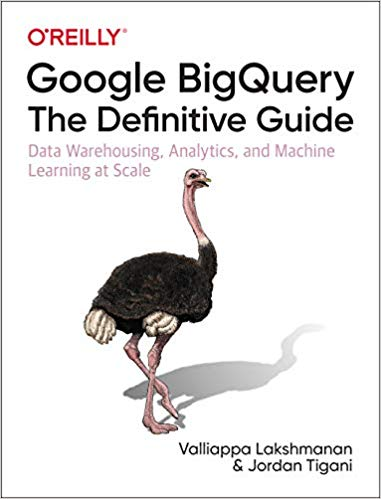

# bigquery-oreilly-book

Source code accompanying:

<table>
<tr>
  <td>
  
  </td>
  <td>
  <a href="https://www.oreilly.com/library/view/google-bigquery-the/9781492044451/">BigQuery: The Definitive Guide</a>  
  by Valliappa Lakshmanan and Jordan Tigani  
  O'Reilly, Nov 2019
  </td>
  <td>
    <a href="https://amazon.com/Google-BigQuery-Definitive-Warehousing-Analytics/dp/1492044466">Buy on Amazon</a>
  </td>
  <td>
    <a href="https://www.oreilly.com/library/view/google-bigquery-the/9781492044451/">Read online on Safari</a>
  </td>
</table>

## After June 2020
Articles that update parts of the book
* [Validating successful execution of BigQuery scripts using ASSERT](https://medium.com/google-cloud/validating-successful-execution-of-bigquery-scripts-using-assert-c82f7ff9cfa8)
* [RANGE_BUCKET](https://stackoverflow.com/questions/62355815/how-do-you-replace-a-value-by-its-percentile-in-bigquery)
* [How to right-size your flat-rate and flex slots reservations in BigQuery](https://medium.com/google-cloud/how-to-move-from-on-demand-pricing-to-reservations-in-bigquery-65552cbebd45)
* [How to do text similarity search and document clustering in BigQuery](https://towardsdatascience.com/how-to-do-text-similarity-search-and-document-clustering-in-bigquery-75eb8f45ab65)
* [Trying out Data QnA on BigQuery and Google Sheets](https://medium.com/daas-labs/trying-out-data-qna-on-bigquery-and-google-sheets-e47939fddf25)
* [How to load XML data into BigQuery using Python Dataflow](https://medium.com/google-cloud/how-to-load-xml-data-into-bigquery-using-python-dataflow-fd1580e4af48)
* [The best of both worlds: Calling Auto ML from BigQuery](https://towardsdatascience.com/the-best-of-both-worlds-calling-auto-ml-from-bigquery-9dfd433a45d6)
* [Loading and transforming data into BigQuery using dbt](https://medium.com/google-cloud/loading-and-transforming-data-into-bigquery-using-dbt-65307ad401cd)

## January 2020 to June 2020
Articles that update parts of the book, and incorporated into text in June 12, 2020 edition.
* [Integration between TensorFlow 2.0 and BigQuery](https://towardsdatascience.com/how-to-read-bigquery-data-from-tensorflow-2-0-efficiently-9234b69165c8)
* [How to query geographic raster data in BigQuery efficiently](https://medium.com/google-cloud/how-to-query-geographic-raster-data-in-bigquery-efficiently-b178b1a5e723)
* [Backing up and restoring a BigQuery table/view/dataset](https://medium.com/google-cloud/how-to-backup-a-bigquery-table-or-dataset-to-google-cloud-storage-and-restore-from-it-6ef7eb322c6d)
* [How to copy a BigQuery dataset from one region to another](https://medium.com/google-cloud/how-to-copy-a-bigquery-dataset-from-one-region-to-another-8388d74da2ac)
* [Training a recommendation model for Google Analytics data using BigQuery ML](https://towardsdatascience.com/training-a-recommendation-model-for-google-analytics-data-using-bigquery-ml-2327f9a2e8e9)
* [Using BigQuery (and BigQuery ML) from Kubeflow Pipelines](https://medium.com/google-cloud/using-bigquery-and-bigquery-ml-from-kubeflow-pipelines-991a2fa4bea8)
* [Displaying BigQuery results on Google Maps using Data Studio](https://medium.com/google-cloud/displaying-bigquery-results-on-google-maps-using-data-studio-bded264bfd53)
* [Using BigQuery Flex Slots to run machine learning workloads more efficiently](https://medium.com/google-cloud/using-bigquery-flex-slots-to-run-machine-learning-workloads-more-efficiently-7fc7f400f7a7)
* [How to export a BigQuery ML model and deploy it for online prediction](https://medium.com/@lakshmanok/how-to-export-a-bigquery-ml-model-and-deploy-it-for-online-prediction-a7e4d44c4c93)
